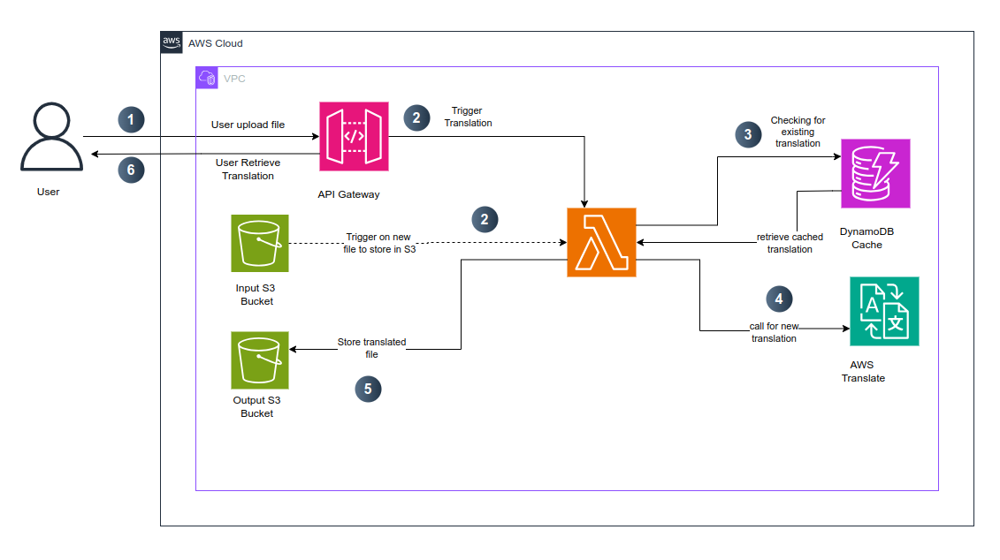

# AWS Translation System Documentation

## 1. Introduction

### Problem Statement

In a globalized world, businesses and individuals require fast and accurate translation services to break language barriers. Manual translation is costly and time-consuming, while traditional translation APIs often lack efficiency and scalability. Organizations need a solution that provides:

- **Automated, high-quality translations** with minimal manual intervention.

- **Scalability** to handle varying translation workloads.

- **Cost-effectiveness** by reducing redundant translations.

- **Security** to protect sensitive data.

### Solution Overview

The AWS Translation System is an automated, serverless solution designed to efficiently translate text using AWS services. It leverages Amazon API Gateway, AWS Lambda, Amazon S3, Amazon DynamoDB, and Amazon Translate to process and store translations securely. The system is designed with **high availability, security,** and **performance optimization** in mind.

### Key Benefits

- **Automated Translation Pipeline** – Reduces manual efforts.

- **High Performance** – Caches previous translations to minimize API costs.

- **Scalability** – Uses AWS Lambda to dynamically handle translation requests.

- **Security & Compliance** – Implements IAM roles, encryption, and API authentication.

## 2. Architecture Overview



System Flow

1. **User uploads a JSON file** via the ```/upload ```  endpoint.

2. **API Gateway triggers a Lambda function** to store the file in ```TRANSLATION_INPUT_BUCKET_NAME.```

3. **Lambda checks DynamoDB** cache for previous translations.

4. If no cache exists, **AWS Translate processes the text.**

5. **Translated output is stored** in ```TRANSLATION_OUTPUT_BUCKET_NAME.```

6. **Api Gateway returns the translated output**

## 3. Deployment Guide

### Prerequisites

- AWS CLI installed and configured with access credentials.

- Terraform installed for Infrastructure as Code (IaC) deployment.

- IAM permissions to create and manage AWS resources.

- Postman or curl for testing API endpoints.